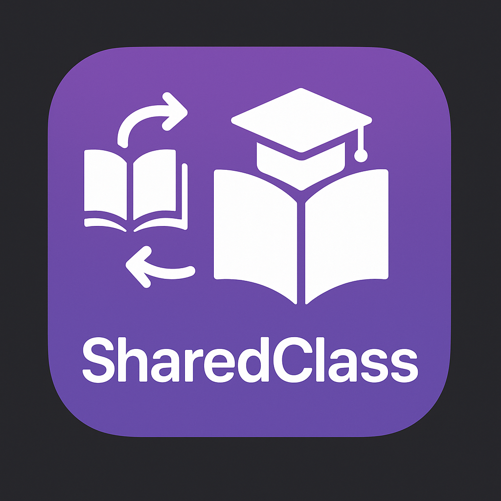
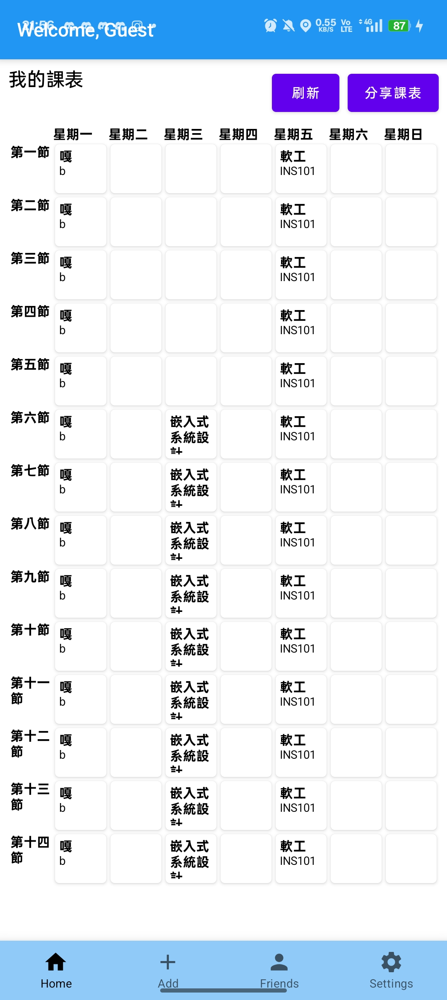
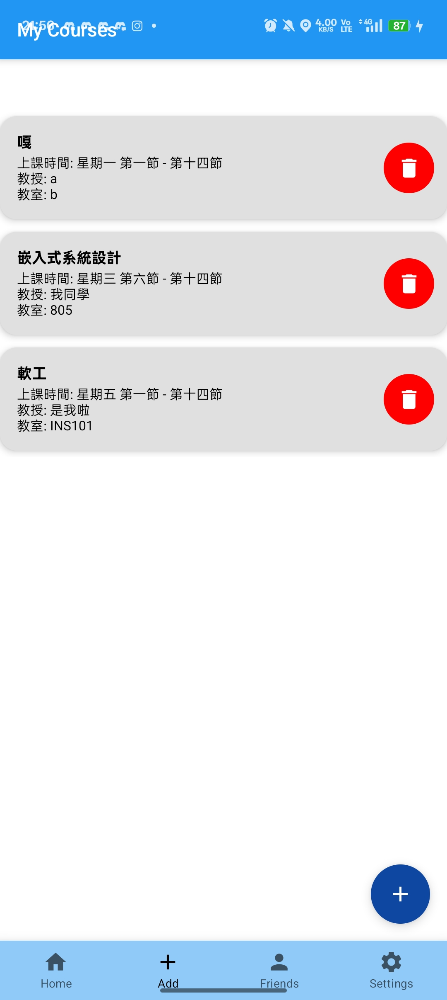
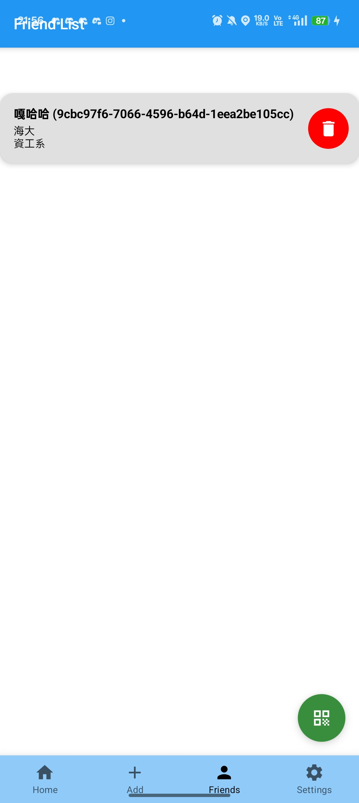
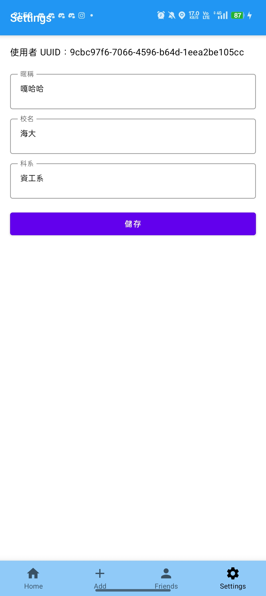

# SharedClassApp



## 介紹

SharedClassApp 是一款專為大學生設計的課表分享與好友管理應用程式。用戶可以輕鬆建立、管理自己的課表，並透過 QR Code 與朋友交換課表資訊，快速查詢彼此的上課時間，提升課程協調與社交便利性。

---

## 特色功能

- 📅 **課表管理**：新增、刪除、修改課程資訊（課名、教授、教室、星期、節次、課號）。
- 🤝 **好友管理**：新增、刪除好友，並可查看好友的課表。
- 🔄 **課表分享**：一鍵產生 QR Code，讓好友掃描即可取得你的課表。
- 📷 **QR Code 掃描**：支援相機與相簿掃描 QR Code，快速導入好友課表。
- 🏫 **個人資訊設定**：設定姓名、學校、科系等個人資訊，分享時一併傳遞。

---

## 畫面截圖

|               主畫面                |                新增課堂                |                 好友列表                 |                 個人資料                 |
|:--------------------------------:|:----------------------------------:|:------------------------------------:|:------------------------------------:|
|  |  |  |  |

---

## 安裝方式

1. **Clone 專案**
   ```sh
   git clone https://github.com/GahahaWang/AndroidFinalProject.git
   ```